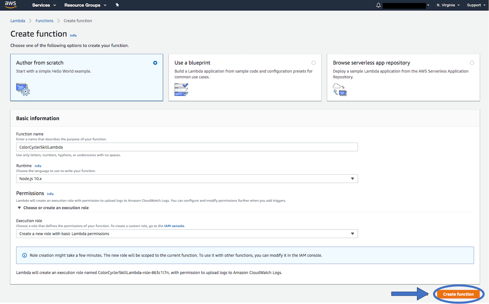
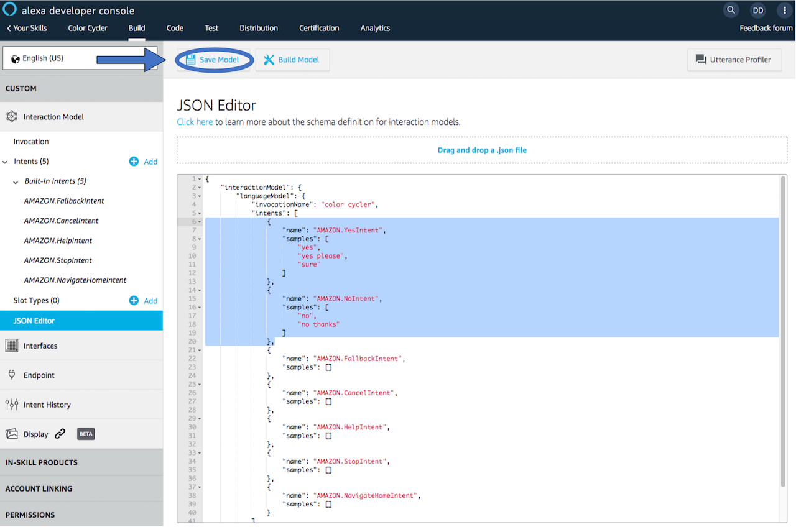
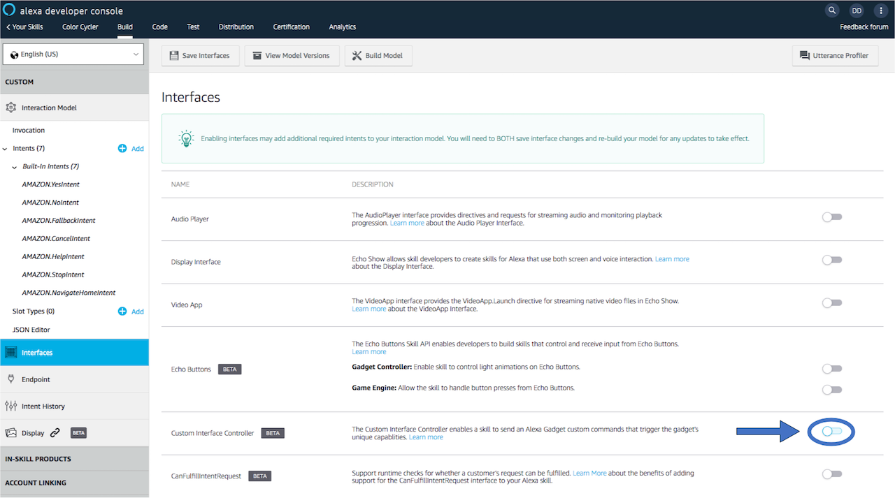

# Color Cycler Gadget


**This guide steps through the process of creating an Alexa Gadget with an LED and a button, that cycles through different colors and reports the LED color when the button is pressed.**

## Prerequisites

- In order to to run this example **you should already have a Raspberry Pi** with the **Alexa-Gadgets-Raspberry-Pi-Samples software** installed. Learn more in the [project README](../../../README.md). In addition, you will need the following hardware:
  - [Header pins](https://thepihut.com/products/adafruit-break-away-0-1-2x20-pin-strip-dual-male-header) soldered to your Raspberry Pi (used for connecting hardware)
  - common anode [RGB LED](https://thepihut.com/products/adafruit-diffused-rgb-tri-color-led-common-anode)
  - Three [220 ohm resistors](https://thepihut.com/products/adafruit-through-hole-resistors-220-ohm-5-1-4w-pack-of-25)
  - [Button](https://thepihut.com/products/adafruit-tactile-button-switch-6mm-x-20-pack)
  - Six male-female [jumper wires](https://thepihut.com/products/adafruit-premium-female-male-extension-jumper-wires-20-x-6)
  - [Breadboard](https://thepihut.com/products/raspberry-pi-breadboard-half-size)


## Step 1: Connect the RGB LED and button to your Pi

Before getting started with instructions on wiring your gadget, please note the following:

* The wire coloring mentioned below is for reference sake only, for making it easier to follow the setup instructions using the diagrams. You can use wires with any colors, as long as you connect the wires to the correct Raspberry Pi pins and breadboard holes based on the instructions.
* Breadboards come with holes labeled from 1-30 or 1-60 (based on the size of the breadboard) for rows and A-J for columns. The instructions below has references to the hole labels based on the setup shown in Figure 3, you can use different holes as long as the hardware components are placed correctly as shown in Figure 3.
* The Raspberry Pi comes with Pins labelled from 1-40. You need to connect the wires to the exact pins as mentioned in the instructions, as the gadget code is configured to use these specific pins.

The following steps walk you through connecting the RGB LED and button:

1. **Make sure your Raspberry Pi is powered off.**
2. To connect a RGB LED, connect jumper wires to the vcc and [GPIO](https://projects.raspberrypi.org/en/projects/physical-computing/3) pins on the Raspberry Pi as shown in the wiring diagram below (Figure 3):
    * Brown wire to the Pin 1 (3.3v) of Raspberry Pi,
    * Red wire to Pin 3 (GPIO 2) of Raspberry Pi,
    * Green wire to Pin 5 (GPIO 3) of Raspberry Pi,
    * and Blue wire to Pin 7 (GPIO 4) of Raspberry Pi.
3. Push the common anode RGB LED's legs into the bread board, starting from Hole A5 to A8 such that:
(refer to Figure 1 for RGB LED Pinout)
    * the leftmost leg (Red) is placed in hole A5,
    * the longest leg (VCC) is second from the left and is placed in hole A6,
    * the third leg from left (Green) is placed in hole A7,
    * and, the rightmost leg (Blue) is placed in hole A8.
4. As shown in the wiring diagram below (Figure 3), place one end of three 220 ohms resistors in the holes D5, D7, and D8 respectively of the breadboard, such that they connect to the rows connected to the 1st (Red), 3rd (Green), and 4th (Blue) legs of the RGB LED from the left (refer to Figure 1 for RGB LED Pinout). Place the other end of the three resistors in the holes F5, F7, and F8 respectively of the breadboard as shown in Figure 3.
5. Connect the Brown wire directly into hole D6 of the breadboard to connect  it to the longest leg (VCC) of the RGB LED.
6. Connect the Red wire into hole G5 of the breadboard to connect it to the resistor connected to the 1st leg from the left (Red), the Green wire into hole G7 of the breadboard to connect it to the resistor connected to the 3rd leg from the left (Green), and the Blue wire into hole G8 of the breadboard to connect it to the resistor connected to the 4th leg from the left (Blue).
7. To connect a button, connect jumper wires to the Raspberry Pi pins as shown in the wiring diagram below (Figure 3):
    * Black wire to the Pin 6 (GND) of Raspberry Pi,
    * Orange wire to Pin 8 (GPIO 14) of Raspberry Pi.
8. Push the button into the breadboard, such that both the signal pins are in the holes A3 and D3 of the breadboard; and the GND pins are in the holes A1 and D1 of the breadboard. (refer to Figure 2 for Button Pinout).
9. As shown in the wiring diagram below (Figure 3), connect the Orange wire to the hole E3 of the breadboard; and the Black wire to the hole E1 of the breadboard.
10. **Once this setup is complete, start up your Pi.**


## Step 2: Configure your credentials

Now that the RGB LED and the button are connected to your Pi, you can continue on with the example.

As with any example, you'll need to first add the credentials that are associated with the gadget you created in the [Alexa Voice Service Developer Console](https://developer.amazon.com/avs/home.html#/avs/home):

1. On the command line of your Pi, navigate to `/home/pi/Alexa-Gadgets-Raspberry-Pi-Samples/src/examples/color_cycler` and open the `color_cycler.ini` file within that folder.
2. Change the `amazonId` from `YOUR_GADGET_AMAZON_ID` to the **Amazon ID** that is displayed on the gadget's product page in the Alexa Voice Service Developer Console.
3. Change the `alexaGadgetSecret` from `YOUR_GADGET_SECRET` to the **Alexa Gadget Secret** that is displayed on the gadget's product page in the Alexa Voice Service Developer Console.

You can also use the launch script's setup mode to configure all the credentials for all the examples at once as follows:
* Start the launch script in setup mode
    ```
    sudo python3 launch.py --setup
    ```
* Enter *'y'* when prompted for configuring the gadget credentials; and enter the `amazonId` and `alexaGadgetSecret` that is displayed on the gadget's product page in the Alexa Voice Service Developer Console.

    

To learn more, refer to [Register a Gadget](https://developer.amazon.com/docs/alexa-gadgets-toolkit/register-gadget.html) in the Alexa Gadgets Toolkit documentation.

## Step 3: Explore the example

The example follows the same model as other examples that you can browse within the Alexa-Gadgets-Raspberry-Pi-Samples project.

### Configuration

Within the `color_cycler.ini` file, in addition to the credentials you just modified, you will see a group of `[GadgetCapabilities]` that this gadget is registering for. In this case, it is registering for a custom interface called `Custom.ColorCyclerGadget`:
```
[GadgetCapabilities]
Custom.ColorCyclerGadget = 1.0
```

In this example, you will be using version 1.0 of a custom interface that you will define. This interface is accessible via a [custom skill](https://developer.amazon.com/docs/custom-skills/understanding-custom-skills.html) that you will create using Python or Node.js.

### Code

Within `color_cycler.py`, you'll notice the import and use of gpiozero library for using Raspberry Pi's GPIO capabilities to control the RGB LED and button, as well as other packages:

```python
from gpiozero import RGBLED, Button
from colorzero import Color
import json
```

You'll also notice the setup of the RGB LED and the button. Note that while setting up the RGB LED, the `active_high` parameter should be set to False for common anode LED or True for common cathode LED.

```python
RGB_LED = RGBLED(GPIO_LED_RED, GPIO_LED_GREEN, GPIO_LED_BLUE,
                 active_high=False, initial_value=(0, 0, 0))

BUTTON = Button(GPIO_BUTTON)
```

You will also see custom callbacks that react to the directives that are received through the custom interface (`Custom.ColorCyclerGadget`) that you will create. For this example, you will create 2 different directives (`BlinkLED` and `StopLED`) under the same custom interface.

The callback function names are defined in the following format: on_custom_*`namespace`*_*`name`* (`namespace` should be without `Custom.` prefix) as described in [Custom Callbacks](../../../README.md#CustomCallbacks) section.

```python
def on_custom_colorcyclergadget_blinkled(self, directive):
    """
    Handles Custom.ColorCyclerGadget.BlinkLED directive sent from skill
    by triggering LED color cycling animations based on the received parameters
    """
    payload = json.loads(directive.payload.decode("utf-8"))

    self.lock.acquire()
    # Initialize the color animation states based on parameters received from skill
    self.colors_list = payload['colors_list']
    self.intervalMs = payload['intervalMs']
    self.iterations = payload['iterations']
    self.cycle_count = 0
    self.game_active = bool(payload['startGame'])
    self.keep_cycling = True
    self.lock.release()

def on_custom_colorcyclergadget_stopled(self, directive):
    """
    Handles Custom.ColorCyclerGadget.StopLED directive sent from skill
    by stopping the LED animations
    """
    # Turn off the LED and disable the color animation states to stop the LED cycling animation
    RGB_LED.off()
    self.lock.acquire()
    self.keep_cycling = False
    self.game_active = False
    self.lock.release()
```

`BlinkLED` directive will animate the RGB LED based on the parameters received from the custom skill, whereas `StopLED` directive will turn off any ongoing LED animation.

You'll also notice that a separate thread is created for animating the RGB LED based on the color animation states.

```python
self.led_thread = threading.Thread(target=self._led_blink)
self.led_thread.start()
```
The callbacks for `BlinkLED` and `StopLED` will change the color animation states, and the infinite loop running in the LED animation thread will animate the RGB LED based on these changes.

```python
def _led_blink(self):
    """
    Plays the LED cycling animation based on the color animation states
    """
    while True:
        # If cycling animation is still active
        if self.keep_cycling and self.cycle_count < len(self.colors_list) * self.iterations:
            self.lock.acquire()
            self.color = self.colors_list[self.cycle_count
                                            % len(self.colors_list)]
            self.cycle_count = self.cycle_count + 1
            self.lock.release()

            # Set the color for the LED
            RGB_LED.color = Color(self.color.lower())

            # Display the color for specified interval before switching again
            time.sleep(self.intervalMs/1000)

        # If button is pressed, display the current color for 5 seconds
        elif not self.keep_cycling and self.game_active:
            time.sleep(5)
            RGB_LED.off()
            self.lock.acquire()
            self.game_active = False
            self.lock.release()
        else:
            time.sleep(0.1)
```

You will also see a callback setup for the button press:
```python
BUTTON.when_pressed = self._button_pressed
```

This callback will report the color of the LED back to the custom skill using custom event `ReportColor` under the custom interface `Custom.ColorCyclerGadget`.
```python
def _button_pressed(self):
    """
    Callback to report the LED color to the skill when the button is pressed
    """
    if self.game_active:
        logger.debug('Button Pressed: Current color = ' + self.color)

        # Send custom event to skill with the color of the LED
        payload = {'color': self.color}
        self.send_custom_event(
            'Custom.ColorCyclerGadget', 'ReportColor', payload)

        self.lock.acquire()
        # Stop the LED cycling animation
        self.keep_cycling = False
        self.lock.release()
```

## Step 4: Create your Custom Skill

For an Alexa Gadget to receive and react to custom directives and for Alexa to receive and react to custom events sent from the gadget, the custom directives and the custom events should be sent and received respectively by a [custom skill](https://developer.amazon.com/docs/custom-skills/understanding-custom-skills.html). The skill can be coded in any language you like, however Alexa Skills Kit SDK is offered only for NodeJS, Python and Java and two example skills are provided with this sample: a NodeJS version, and a Python version. The following steps guide you through setting up and deploying the example skill that will work with your gadget. The skill sends down directives to your gadget to control the animation of the RGB LED and receives events from your gadget reporting the color of the LED when the button is pressed.

**Note**: although two versions of the example skill are provided, one for NodeJS and one for Python, the two are different implementations of the same thing, provided for convenience. You should only deploy one of the skills, depending on which language you are more comfortable with.

The instructions below will walk you through deploying the example skills from scratch, using the Amazon Developer Portal web UI and the Amazon Web Services (AWS) console UI. It is also possible to deploy the example skills using the [ASK CLI](https://developer.amazon.com/docs/smapi/quick-start-alexa-skills-kit-command-line-interface.html).

The setup and deployment process is nearly identical for both the NodeJS and the Python skill samples, with minor changes in the steps required to package the code and the configuration of the Lambda function: one uses the NodeJS runtime and the other Python; and the former uses `npm` for managing dependencies while the latter uses `pip`.  

For the NodeJS skill you must have NodeJS 8 or newer installed on your computer. If you don't have NodeJS installed, you can quickly get it installed using [NVM (the Node Version Manager)](https://github.com/nvm-sh/nvm/blob/master/README.md) on Linux and Mac, or using [NVM for Windows](https://github.com/coreybutler/nvm-windows) on Windows.

For the Python skill you must have Python 3.6 or newer installed on your computer. To check what version of Python you have installed, type this command in the terminal on your machine:

```bash
python --version
```

You should see something like: "Python 3.6"


### Prepare the skill code for Deployment (NodeJS Version)

Before you can deploy the code to Lambda you must run `npm install` to get copies of the dependent packages used by the skill. These dependencies will be downloaded by `npm` (the NodeJS Package Manager) locally, into a folder called `node_modules` that will be placed into the `skill/NodeJS/lambda/custom` directory.

The skill code is provided in the [index.js](./skill/NodeJS/lambda/custom/index.js), and the dependencies are mentioned in [package.json](./skill/NodeJS/lambda/custom/package.json)

**IMPORTANT:** Make sure to execute the following commands **from the `lambda/custom` directory** of the NodeJS skill sample in this repository.

1. **Install npm dependencies** by navigating into the `skill/NodeJS/lambda/custom` directory and running the npm command: `npm install` (you will need to run this command from the terminal, or command prompt on Windows)
```bash
npm install
```
2. Create a zip archive of the code and dependencies while still in the `skill/NodeJS/lambda/custom` directory (remember, we are zipping the contents of the folder, not the folder itself)

```bash
zip -r ../../skill-code.zip .
```

The file `skill-code.zip`, located in the `skill/NodeJS` directory, will contain the skill code as well as the necessary dependencies and will be uploaded to Lambda in the next section.

### Prepare the skill code for Deployment (Python Version)

Before you can deploy the code to Lambda you must run `pip install` to get copies of the dependent packages used by the skill. These dependencies will be downloaded by `pip` (the package installer for Python) locally, into a directory called `skill_env` that will be placed into the `skill/python/lambda` directory.

The skill code is provided in the [lambda_function.py](./skill/Python/lambda/lambda_function.py), and the dependencies are mentioned in [requirements.txt](./skill/Python/lambda/requirements.txt)

**IMPORTANT:** Make sure to execute the following command **from the `lambda` directory** of the Python skill sample in this repository.

1. On your system, navigate into the `skill/python/lambda` directory and **install the dependencies** in a new folder called “skill_env” using the following command:
```bash
pip install -r requirements.txt -t skill_env
```
2. Copy the skill code from the `skill/python/lambda/` folder into the `skill_env` folder:
```bash
cp lambda_function.py skill_env/
```
3. Create a zip archive of the code and dependencies while still in the `skill/python/lambda` directory (remember, we are zipping the contents of the folder, not the folder itself)
```bash
cd skill_env
zip -r ../../skill-code.zip .
```

The file `skill-code.zip`, located in the `skills/Python` directory, will contain the skill code as well as the necessary dependencies and will be uploaded to Lambda in the next section.

(Optional) Follow the ASK Python SDK [Getting Started documentation](https://alexa-skills-kit-python-sdk.readthedocs.io/en/latest/GETTING_STARTED.html#adding-the-ask-sdk-for-python-to-your-project), to check alternative ways of installing the sdk and deploying to AWS Lambda console.

### Create your Lambda function

1. Sign in to the [AWS Management Console](https://console.aws.amazon.com/lambda/home) and open the [AWS Lambda Console](https://console.aws.amazon.com/lambda/home).

    

2. Make sure the **Region** on the top right corner is set to *N. Virginia*.
3. Click **Create function**, leave **Author from scratch** selected, and name the function whatever you like.

    

4. Select *Runtime* as *NodeJs 10.x* or *Python 3.6*, depending on which skill you are deploying.

5. For **Permissions**, if you don't already have a role that allows for basic Lambda execution, follow [Defining a New Role for the Function](https://developer.amazon.com/docs/custom-skills/host-a-custom-skill-as-an-aws-lambda-function.html#define-new-role) to create a new role from a template.

6. Click on **Create function**.

    

7. Change the Code entry type to **Upload a ZIP** and select the zip you created in the **Prepare the Code for Deployment** section above.

    

8. Save the Lambda by clicking the **Save** button in the upper right corner of the screen.

    

### Explore the skill code

Depending on which language you picked, you can find a brief exploration of the code in the README files within each skill sample directory, corresponding to your language:

 * [README For NodeJS](./skill/NodeJS/README.md) 
 * [README For Python](./skill/Python/README.md)


### Create your skill

1. Sign in to the [Alexa Skills Kit Developer Console](https://developer.amazon.com/alexa/console/ask)</a> and click **Create Skill**.

    

2. Enter **Skill name** as *color cycler*. Leave the **Choose a model to add to your skill** to *Custom*, and **Choose a method to host your skill’s backend resources** to *Provision your own*.
3. Click on **Create skill** on the top right corner of the screen.

    

4. On the **Choose a template** screen, choose *Start from scratch* and click on the **Choose** button on the top right corner of the screen.

    

5. The skill is created. Now, click on **JSON Editor** in the left pane.

    

    * Add utterance samples for Amazon.YesIntent and Amazon.NoIntent as follows:
    **Note:** This sample assumes that the skill is a US-based skill.

    ```json
    {
        "name": "AMAZON.YesIntent",
        "samples": [
            "yes",
            "yes please",
            "sure"
        ]
    },
    {
        "name": "AMAZON.NoIntent",
        "samples": [
            "no",
            "no thanks"
        ]
    },
    ```  
  
    * Click on **Save Model** on the top.

        

6. On the left, click **Endpoint**.

    

7. Select **AWS Lambda ARN**.

    

8. Copy the skill ID.

    

9. Next, go back to your Lambda function in the [AWS Lambda Console](https://console.aws.amazon.com/lambda/home).
10. In the AWS Lambda Console, on the left, under **Add Triggers**, select **Alexa Skills Kit**.

    

11. At the bottom of the screen, paste in the skill ID, and then click **Add**. Next.

    

12. **Save** the Lambda.

    

13. At the top of the screen, copy the ARN.

    

14. Return to editing your skill in the [Alexa Skills Kit Developer Console](https://developer.amazon.com/alexa/console/ask).
15. Within the **Endpoint** section, paste in the Lambda ARN from the function that you created, in the **Default Region** field under **AWS Lambda ARN**, and then click **Save Endpoints**.

    

14. On the left, select **Interfaces** and turn on the toggle for *Custom Interface Controller* to enable the skill to use Custom Interfaces.

    

15. Then, click on **Save Interfaces** at the top of the screen.

    

16. On the left, select **Invocation**. Then, at the top of the screen, click **Build Model**.

    

16. It will take a few seconds to build the model. A *Build Successful* message will be posted on the bottom right of the screen once the model is built successfully.

    


### Test your skill
At this point, it's best to ensure that your skill is working before you move on. You can do this as follows:
1. In the [Alexa Skills Kit Developer Console](https://developer.amazon.com/alexa/console/ask), select your skill. Then, at the top, click **Test**.

    

2. Under the header, you will see a dropdown menu, click on it and select *Development*.

    

3. You now have a few ways to test that your skill is working:
    * **Using the Alexa Simulator in the Developer Console**: If you are continuing from the previous step, you are already in the **Test** tab of your skill. Type in *'Open Color Cycler'* and verify that the response comes back without an error. Alexa should respond indicating that no gadgets were found (since this is a simulator). You can also see the JSON for Alexa's response.

        

    * **Using the Echo device that is paired to your gadget**: Say *"Alexa, Open Color Cycler"*. If the gadget is connected, Alexa should respond with a welcome message describing the game and asking if you are ready. Else, Alexa will respond indicating that no gadgets were found.

## Step 5: Test your gadget

In order for this gadget to function, it will need to be paired to a [compatible Echo device](https://developer.amazon.com/docs/alexa-gadgets-toolkit/overview-bluetooth-gadgets.html#device-bluetooth-support). Before running the example, refer to the [pairing guide](../../../README.md#pairing-your-gadget-to-an-echo-device) to learn how to pair your gadget.

With your Echo device nearby, run the Python code:

```
sudo python3 launch.py --example color_cycler
```

Once your gadget paired/connected, ask Alexa:

*"Alexa, open Color Cycler"*

The gadget will receive the `BlinkLED` directive which will turn its LED to green, and Alexa will describe the game and ask you if you're ready to play.

If you answer *'yes'*, the gadget will receive another `BlinkLED` directive to animate the LED to cycle through a list of colors. Press the button on the gadget within 10 seconds, and Alexa will respond with the color on the LED as a result of the `ReportColor` being sent from the gadget.

If you don't press the button within 10 seconds or if you answer *'no'* to the initial prompt or at any time during the game you stop or cancel the skill, the gadget will receive a `StopLED` directive which will turn off the LED animation.

### Troubleshooting Color cycler gadget:

* If upon opening the Color Cycler skill, Alexa says ‘No gadgets found.', ensure that the color cycler gadget is connected successfully. If your gadget fails to connect, stop the Python script by pressing `CTRL + C`, and run it again: `sudo python3 launch.py --example color_cycler`.
* If the RGB LED doesn’t light up when the skill is launched, or if the reported color doesn’t match with the color on the RGB LED, ensure that the RGB LED is connected correctly by following the instructions in **steps 2-6** in **Step 1: Connect the RGB LED and button to your Pi.**
* If pressing the button doesn’t make Alexa report the color, ensure that the button is connected correctly by following the instructions in **steps 7-9** in **Step 5: Connect the RGB LED and button to your Pi.**

## What's next

Now that you understand working with Custom Directives and Custom Events, you can alter this example or create a new Skill and Gadget code to build upon.

To learn more about Alexa Gadgets Toolkit capabilities, [review the documentation](https://developer.amazon.com/docs/alexa-gadgets-toolkit/features.html).
