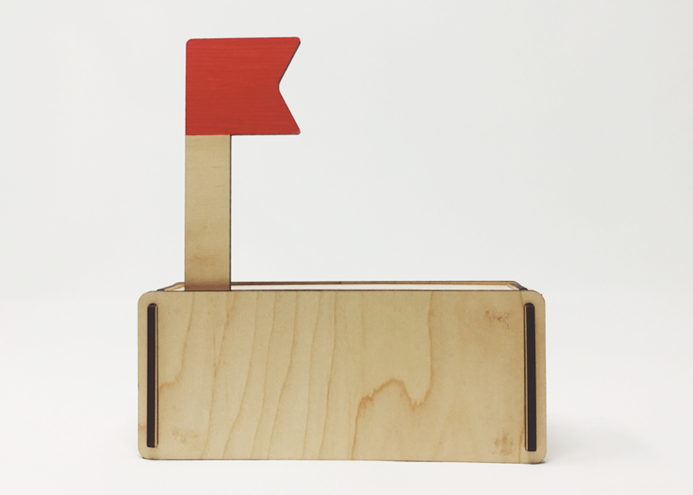
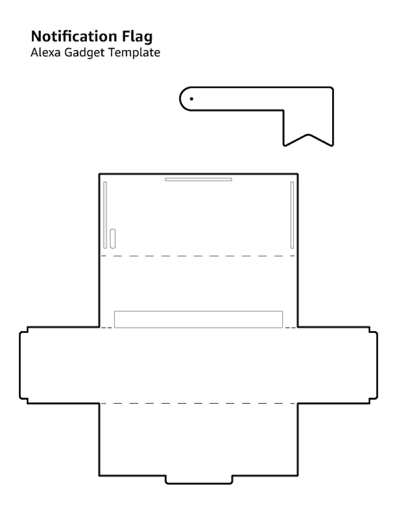

# Notification Flag Gadget



**This guide steps through the process of creating an Alexa Gadget that rotates a servo to raise and lower a flag when a notification is received or cleared on a paired Echo device.**

## Prerequisites


In order to to run this example **you should already have** a Raspberry Pi with the **Alexa-Gadgets-Raspberry-Pi-Samples software** installed. Learn more in the [project README](../../../README.md). In addition, you will need the following hardware:

- [Header pins](https://www.amazon.com/DIKAVS-Break-Away-2x20-pin-Header-Raspberry/dp/B075VNBD3R) soldered to your Raspberry Pi (used for connecting hardware)
- [Micro servo](https://www.amazon.com/MakerDoIt-Micro-Arduino-Walking-Control/dp/B07C5PGD3Q/)
- Three male-female [jumper wires](https://www.amazon.com/LANDZO-Multicolored-Breadboard-Raspberry-Arduino/dp/B01IB7UOFE/)

## Step 1: Connect the servo to your Pi

The following steps walk you through connecting the servo:

1. Make sure your Raspberry Pi is powered off.
2. Connect jumper wires to the 5V, GPIO25 (Pin 22), and GRND pins. [Learn more](https://www.raspberrypi.org/documentation/usage/gpio/)
3. Connect jumper wires to the servo using the diagram below. Red is power, black/brown is ground, and yellow/orange is signal.
4. Once you've connected the servo to the Pi, start up your Pi.


## Step 2: Configure your credentials

Now that the servo is connected to your Pi, you can continue on with the example.

As with any example, you'll need to first add the credentials that are associated with the gadget you created in the [Alexa Voice Service Developer Console](https://developer.amazon.com/avs/home.html#/avs/home):

1. On the command line of your Pi, navigate to `/home/pi/Alexa-Gadgets-Raspberry-Pi-Samples/src/examples/notification` and open the `notification.ini` file within that folder.
2. Change the `amazonId` from `YOUR_GADGET_AMAZON_ID` to the **Amazon ID** that is displayed on the gadget's product page in the Alexa Voice Service Developer Console.
3. Change the `alexaGadgetSecret` from `YOUR_GADGET_SECRET` to the **Alexa Gadget Secret** that is displayed on the gadget's product page in the Alexa Voice Service Developer Console.

You can also use the launch script's setup mode to configure all the credentials for all the examples at once as follows:
* Start the launch script in setup mode
    ```
    sudo python3 launch.py --setup
    ```
* Enter *'y'* when prompted for configuring the gadget credentials; and enter the `amazonId` and `alexaGadgetSecret` that is displayed on the gadget's product page in the Alexa Voice Service Developer Console.

    

To learn more, refer to [Register a Gadget](https://developer.amazon.com/docs/alexa-gadgets-toolkit/register-gadget.html) in the Alexa Gadgets Toolkit documentation.

## Step 3: Explore the example

The example follows the same model as other examples that you can browse within the Alexa-Gadgets-Raspberry-Pi-Samples project.

### Configuration

Within the `notification.ini` file, in addition to the credentials you just modified, you will see a group of `[GadgetCapabilities]` that this gadget is registering for. In this case, it is registering for notifications:

```
[GadgetCapabilities]
Notifications = 1.0
```

In this example, you will be using version 1.0 of the [Notifications interface](https://developer.amazon.com/docs/alexa-gadgets-toolkit/notifications-interface.html), and responding to the setting and clearing of notifications received on the paired Echo device.

### Code

Within `notification.py`, you'll notice the import and use of Raspberry Pi's GPIO capabilities using the [gpiozero](https://gpiozero.readthedocs.io) library:

```python
import time
from gpiozero import AngularServo
```

You'll also see the configuration of servo motor using gpiozero's AngularServo:

```python
SERVO = AngularServo(GPIO_PIN, initial_angle=-90, min_pulse_width=0.0005, max_pulse_width=0.002)
```

You'll see callbacks for the setting and clearing of notifications that can be used to control the servo:

```python
def on_notifications_setindicator(self, directive):
    logger.info('Notification set - set servo to 0 degrees')

    # Set angle of servo to 0 degrees
    SERVO.angle = 0
    time.sleep(1)
    SERVO.detach()

def on_notifications_clearindicator(self, directive):
    logger.info('Notification cleared - set servo to -90 degrees')

    # Set angle of servo to -90 degrees
    SERVO.angle = -90
    time.sleep(1)
    SERVO.detach()
```

The above callbacks are listening for the set and cleared states of the notifications received by the paired Echo device to rotate the servo to 90 degrees when a notification is set, and to 0 degrees when notifications are cleared from the paired Echo device.

## Step 4: Test your gadget

In order for this gadget to function, it will need to be paired to a [compatible Echo device](https://developer.amazon.com/docs/alexa-gadgets-toolkit/overview-bluetooth-gadgets.html#device-bluetooth-support). Before running the example, refer to the [pairing guide](../../../README.md#pairing-your-gadget-to-an-echo-device) to learn how to pair your gadget.

With your Echo device nearby, run the Python code:

```
sudo python3 launch.py --example notification
```

Once your gadget paired/connected, try the following commands:

*“Alexa, ask [Quote Maker](https://developer.amazon.com/docs/alexa-voice-service/notifications-overview.html#enable-the-quote-maker-skill-for-testing) to send a notification”*

To trigger a notification, you can use the Quote Maker skill (US only). If the Skill is not enabled, Alexa will prompt you to do so. When the notification is triggered, the servo should rotate to 90 degrees.

*“Alexa, clear my notifications”*

This will clear your notifications and cause the servo to rotate to its starting position at 0 degrees. This will also happen if you listen to your notifications by saying, “Alexa, what are my notifications?”

In each case, you should see a message printed whenever the servo runs, and see/hear the servo move. Note the direction the servo moves. This will help when assembling the physical components of your gadget.

## Step 5: Assemble your gadget

The housing and flag shown in the image above were constructed from laser-cut wood, but any other objects and materials will work. It also doesn't have to be a flag at all. Below is a template for the flag and housing for reference, which you can print out, transfer to cardboard, and assemble:

[Notification-Flag-Template.pdf](../../../docs/_static/pdfs/Notification-Flag-Template.pdf)



You can use [this technique](https://www.youtube.com/watch?v=Gl8i4IYIEXw) to transfer the printed template to cardboard. Once transferred, cut the pieces out and fold to assemble. The flag will need to be attached to the servo using a screw, and the servo can be taped to the cardboard.

Once you have a housing created, place and affix your servo. Make sure to test along the way to make sure the housing and flag are not colliding with other elements when the servo is rotating. You can use the instructions in Step 4 to continually test until your gadget is working just the way you like.

## What's next

You could make a gadget that shows notifications in a variety of ways beyond using a flag. You could also use the flag to indicate something other than a notification.

To learn more about Alexa Gadgets Toolkit capabilities, [review the documentation](https://developer.amazon.com/docs/alexa-gadgets-toolkit/features.html).
