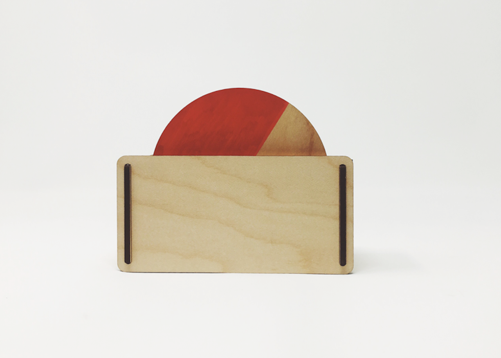
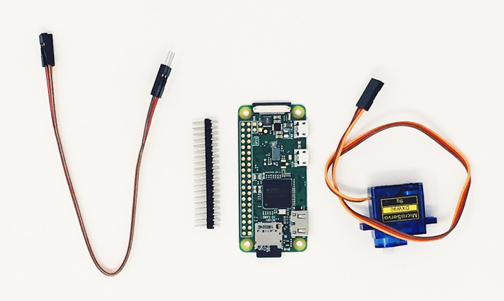

# Timer Gadget



**This guide steps through the process of creating an Alexa Gadget that reacts to a single timer set on an Echo device. A servo rotates a disc to indicate the remaining duration of the timer, when the timer expires, and when a timer is canceled.**

## Prerequisites



In order to to run this example **you should already have** a Raspberry Pi with the **Alexa-Gadgets-Raspberry-Pi-Samples software** installed. Learn more in the [project README](../../../README.md). In addition, you will need the following hardware:

- [Header pins](https://www.amazon.com/DIKAVS-Break-Away-2x20-pin-Header-Raspberry/dp/B075VNBD3R) soldered to your Raspberry Pi (used for connecting hardware)
- [Micro servo](https://www.amazon.com/MakerDoIt-Micro-Arduino-Walking-Control/dp/B07C5PGD3Q/)
- Three male-female [jumper wires](https://www.amazon.com/LANDZO-Multicolored-Breadboard-Raspberry-Arduino/dp/B01IB7UOFE/)

## Step 1: Connect the servo to your Pi

The following steps walk you through connecting the servo:

1. Make sure your Raspberry Pi is powered off.
2. Connect jumper wires to the 5V, GPIO25 (Pin 22), and GRND pins. [Learn more](https://www.raspberrypi.org/documentation/usage/gpio/)
3. Connect jumper wires to the servo using the diagram below. Red is power, black/brown is ground, and yellow/orange is signal.
4. Once you've connected the servo to the Pi, start up your Pi.


## Step 2: Configure your credentials

Now that the servo is connected to your Pi, you can continue on with the example.

As with any example, you'll need to first add the credentials that are associated with the gadget you created in the [Alexa Voice Service Developer Console](https://developer.amazon.com/avs/home.html#/avs/home):

1. On the command line of your Pi, navigate to `/home/pi/Alexa-Gadgets-Raspberry-Pi-Samples/src/examples/timer` and open the `timer.ini` file within that folder.
2. Change the `amazonId` from `YOUR_GADGET_AMAZON_ID` to the **Amazon ID** that is displayed on the gadget's product page in the Alexa Voice Service Developer Console.
3. Change the `alexaGadgetSecret` from `YOUR_GADGET_SECRET` to the **Alexa Gadget Secret** that is displayed on the gadget's product page in the Alexa Voice Service Developer Console.

You can also use the launch script's setup mode to configure all the credentials for all the examples at once as follows:
* Start the launch script in setup mode
    ```
    sudo python3 launch.py --setup
    ```
* Enter *'y'* when prompted for configuring the gadget credentials; and enter the `amazonId` and `alexaGadgetSecret` that is displayed on the gadget's product page in the Alexa Voice Service Developer Console.

    

To learn more, refer to [Register a Gadget](https://developer.amazon.com/docs/alexa-gadgets-toolkit/register-gadget.html) in the Alexa Gadgets Toolkit documentation.

## Step 3: Explore the example

The example follows the same model as other examples that you can browse within the Alexa-Gadgets-Raspberry-Pi-Samples project.

### Configuration

Within the `timer.ini` file, in addition to the credentials you just modified, you will see a group of `[GadgetCapabilities]` that this gadget is registering for. In this case, it is registering for `StateListener` and `Alerts`:

```
[GadgetCapabilities]
Alexa.Gadget.StateListener = 1.0 - timers
Alerts = 1.1
```

In this example, you will be using version 1.0 of the [StateListener interface](https://developer.amazon.com/docs/alexa-gadgets-toolkit/alexa-gadget-statelistener-interface.html), and responding to the `timers` type, as well as using version 1.1 of the [Alerts interface](https://developer.amazon.com/docs/alexa-gadgets-toolkit/alerts-interface.html).

### Code

Within `timer.py` you'll notice the import and use of Raspberry Pi's GPIO capabilities using the [gpiozero](https://gpiozero.readthedocs.io) library, as well as other packages:

```python
import logging
import sys
import threading
import time

from gpiozero import AngularServo
import dateutil.parser

from agt import AlexaGadget
```

You'll also see the configuration of servo motor using gpiozero's AngularServo:

```python
SERVO = AngularServo(GPIO_PIN, initial_angle=90, min_pulse_width=0.0005, max_pulse_width=0.002)
```

In addition, you will see callbacks that define what should happen for the set, expiration, and clearing of a timer:

```python
def on_alerts_setalert(self, directive):
    """
    Handles Alerts.SetAlert directive sent from Echo Device
    """
    # check that this is a timer. if it is something else (alarm, reminder), just ignore
    if directive.payload.type != 'TIMER':
        logger.info("Received SetAlert directive but type != TIMER. Ignorning")
        return

    # parse the scheduledTime in the directive. if is already expired, ignore
    t = dateutil.parser.parse(directive.payload.scheduledTime).timestamp()
    if t <= 0:
        logger.info("Received SetAlert directive but scheduledTime has already passed. Ignoring")
        return

    # check if this is an update to an alrady running timer (e.g. users asks alexa to add 30s)
    # if it is, just adjust the end time
    if self.timer_token == directive.payload.token:
        logger.info("Received SetAlert directive to update to currently running timer. Adjusting")
        self.timer_end_time = t
        return

    # check if another timer is already running. if it is, just ignore this one
    if self.timer_thread is not None and self.timer_thread.isAlive():
        logger.info("Received SetAlert directive but another timer is already running. Ignoring")
        return

    # start a thread to rotate the servo
    logger.info("Received SetAlert directive. Starting a timer for " + str(int(t - time.time())) + "s")
    self.timer_end_time = t
    self.timer_token = directive.payload.token

    # run timer in it's own thread to prevent blocking future directives during count down
    self.timer_thread = threading.Thread(target=self._run_timer)
    self.timer_thread.start()

def on_alerts_deletealert(self, directive):
    """
    Handles Alerts.DeleteAlert directive sent from Echo Device
    """
    # check if this is for the currently running timer. if not, just ignore
    if self.timer_token != directive.payload.token:
        logger.info("Received DeleteAlert directive but not for the currently active timer. Ignoring")
        return

    # delete the timer, and stop the currently running timer thread
    logger.info("Received DeleteAlert directive. Cancelling the timer")
    self.timer_token = None
```

You'll also see code for controlling the rotation of the servo to indicate the remaining duration of the timer, and when a timer has expired or cleared:

```python
def _run_timer(self):
    """
    Runs a timer
    """
    # check every 200ms if we should rotate the servo
    cur_angle = 180
    start_time = time.time()
    time_remaining = self.timer_end_time - start_time
    self._set_servo_to_angle(cur_angle, timeout=1)
    while self.timer_token and time_remaining > 0:
        time_total = self.timer_end_time - start_time
        time_remaining = max(0, self.timer_end_time - time.time())
        next_angle = int(180 * time_remaining / time_total)
        if cur_angle != next_angle:
            self._set_servo_to_angle(cur_angle, timeout=0.3)
            cur_angle = next_angle
        time.sleep(0.2)

    # the timer is expired now, rotate servo back and forth
    # until timer is cancelled
    while self.timer_token:
        self._set_servo_to_angle(175, timeout=1)
        self._set_servo_to_angle(5, timeout=1)

    # the timer was cancelled, reset the servo back to initial state
    self._set_servo_to_angle(0, timeout=1)

def _set_servo_to_angle(self, angle_in_degrees, timeout):
    """
    Sets the servo to the specified angle. Keep this between 0 and 180
    """
    # set the angle of the Servo (min = -90, max = 90)
    SERVO.angle = 90 - float(angle_in_degrees)
    logger.debug('Setting servo to: ' + str(angle_in_degrees))
    time.sleep(timeout)
    SERVO.detach()
```

The above callbacks are listening for the set and cleared states of the timer set on the paired Echo device to rotate the servo as an indication that a timer's duration is incrementing down. When a timer expires, the servo rotates back and forth as an indicator. If a timer is cleared, the servo rotates to its inactive position.

## Step 4: Test your gadget

In order for this gadget to function, it will need to be paired to a [compatible Echo device](https://developer.amazon.com/docs/alexa-gadgets-toolkit/overview-bluetooth-gadgets.html#device-bluetooth-support). Before running the example, refer to the [pairing guide](../../../README.md#pairing-your-gadget-to-an-echo-device) to learn how to pair your gadget.

With your Echo device nearby, run the Python code:

```
sudo python3 launch.py --example timer
```

Once your gadget paired/connected, try the following commands:

*"Alexa, set a 20 second timer"*

This will cause the servo to rotate to the starting position of the timer, and rotate to home position in sync with the duration of the timer. When the timer runs out, the servo should move back and forth to create a visual indicator that the timer is done.

*"Alexa, set a timer for 5 minutes"*

*"Alexa, clear my timer"*

The servo shoud rotate to start position and start counting down. When you cancel the timer, the servo should rotate back to home position.

The Pi should print a message whenever the servo runs, and you should see and hear the servo move. Note the direction the servo moves. This will help when assembling the physical components of your gadget.

> **Note:** While you can set multiple timers on an Echo device, the timer gadget will only show one active timer at a time – the first one that you set.

## Step 5: Assemble your gadget

The housing and disc shown in the image above were constructed from laser-cut wood, but any other objects will work. It also doesn't have to be a disc at all. Below is a template for the disc and housing of your gadget, which you can print out, transfer to cardboard, and assemble:

[Timer-Template.pdf](../../../docs/_static/pdfs/Timer-Template.pdf)


You can use [this technique](https://www.youtube.com/watch?v=Gl8i4IYIEXw) to transfer the printed template to cardboard. Once transferred, cut the pieces out and fold to assemble. The disc will need to be attached to the servo using a screw, and the servo can be taped to the cardboard.

Once you have created the housing, place and affix your servo. Make sure to test along the way to make sure the housing and disc are not colliding with other elements when the servo is rotating. You can use the instructions in Step 4 to continually test until your gadget is working just the way you like.

## What's next

You could make a gadget that shows timers in a variety of ways beyond using a disc. You could also use the rotating disc to indicate something other than a timer counting down.

To learn more about Alexa Gadgets Toolkit capabilities, [review the documentation](https://developer.amazon.com/docs/alexa-gadgets-toolkit/features.html).
