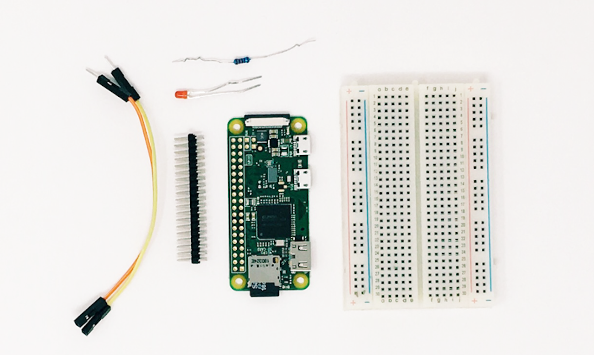
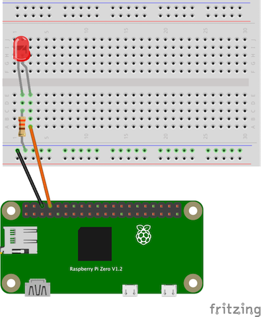

# Wake Word LED Gadget Example

**This guide steps through the process of creating an Alexa Gadget that turns an LED on and off in sync with the detection of the wake word.**

## Prerequisites



In order to to run this example **you should already have** a Raspberry Pi with the Alexa-Gadgets-Raspberry-Pi-Samples software installed. Learn more in the [project README](../../../README.md). In addition, you will need the following hardware:

- [Header pins](https://www.amazon.com/DIKAVS-Break-Away-2x20-pin-Header-Raspberry/dp/B075VNBD3R) soldered to your Raspberry Pi (used for connecting hardware)
- [Breadboard](https://thepihut.com/products/raspberry-pi-breadboard-half-size)
- [LED](https://thepihut.com/products/ultimate-5mm-led-kit)
- [330 ohm resistor](https://thepihut.com/products/ultimate-resistor-kit)
- Two male-female [jumper wires](https://www.amazon.com/LANDZO-Multicolored-Breadboard-Raspberry-Arduino/dp/B01IB7UOFE/)

## Step 1: Connect the LED to your Pi

The circuit consists of a power supply (the Raspberry Pi), an LED that lights up when the power is applied, and a resistor to limit the current that can flow through the circuit.

You will be using one of the 'ground' (GND) pins to act like the 'negative' or zero-volt end of a battery. The 'positive' end of the battery will be provided by a GPIO pin. Here we will use pin 14. When the pin is 'taken high', which means that it outputs 3.3 volts, the LED will light up. Now take a look at the circuit diagram below. [Learn more](https://www.raspberrypi.org/documentation/usage/gpio/) about pin locations.



You should turn your Raspberry Pi OFF for the next bit, just in case you accidentally short something out.

1. Use one of the jumper wires to connect a ground pin to the rail, marked with blue, on the breadboard. The female end goes on the Raspberry Pi's pin, and the male end goes into a hole on the breadboard.
2. Connect the resistor from the same row on the breadboard to a column on the breadboard, as shown above.
3. Push the LED's legs into the breadboard, with the long leg (with the kink) on the right.
4. Complete the circuit by connecting pin 14 to the right-hand leg of the LED. This is the orange wire shown above.
5. Once everything is connected, start up your Pi.

## Step 2: Configure your credentials

Now that the LED is connected to your Pi, you can continue on with the example.

As with any example, you'll need to first add the credentials that are associated with the gadget you created in the [Alexa Voice Service Developer Console](https://developer.amazon.com/avs/home.html#/avs/home):

1. On the command line of your Pi, navigate to `/home/pi/Alexa-Gadgets-Raspberry-Pi-Samples/src/examples/wakeword` and open the `wakeword.ini` file within that folder.
2. Change the `amazonId` from `YOUR_GADGET_AMAZON_ID` to the **Amazon ID** that is displayed on the gadget's product page in the Alexa Voice Service Developer Console.
3. Change the `alexaGadgetSecret` from `YOUR_GADGET_SECRET` to the **Alexa Gadget Secret** that is displayed on the gadget's product page in the Alexa Voice Service Developer Console.

You can also use the launch script's setup mode to configure all the credentials for all the examples at once as follows:
* Start the launch script in setup mode
    ```
    sudo python3 launch.py --setup
    ```
* Enter *'y'* when prompted for configuring the gadget credentials; and enter the `amazonId` and `alexaGadgetSecret` that is displayed on the gadget's product page in the Alexa Voice Service Developer Console.

    

To learn more, refer to [Register a Gadget](https://developer.amazon.com/docs/alexa-gadgets-toolkit/register-gadget.html) in the Alexa Gadgets Toolkit documentation.

## Step 3: Explore the example

The example follows the same model as other examples that you can browse within the Alexa-Gadgets-Raspberry-Pi-Samples project.

### Configuration

Within the `wakeword.ini` file, in addition to the credentials you just modified, you will see a group of `[GadgetCapabilities]` that this gadget is registering for. In this case, it is registering for `StateListener`:

```
[GadgetCapabilities]
Alexa.Gadget.StateListener = 1.0 - wakeword
```

In this example, you will be using version 1.0 of the [StateListener interface](https://developer.amazon.com/docs/alexa-gadgets-toolkit/alexa-gadget-statelistener-interface.html), and responding to the wake word type.

### Code

Within `wakeword.py` you'll notice the import and use of Raspberry Pi's GPIO capabilities using the [gpiozero](https://gpiozero.readthedocs.io) library:

```python
from gpiozero import LED
```
You'll also see the configuration of the LED:

```python
LED = LED(GPIO_PIN)
```

In addition to callbacks for connectivity, you'll see a `StateListener` callback that can be used to control the LED:

```python
def on_alexa_gadget_statelistener_stateupdate(self, directive):
	for state in directive.payload.states:
		if state.name == 'wakeword':
			if state.value == 'active':
				logger.info('Wake word active - turn on LED')
				LED.on()
			elif state.value == 'cleared':
				logger.info('Wake word cleared - turn off LED')
				LED.off()
```

The above callback is listening for the wake word states of active and cleared to control the LED to turn on and off.

## Step 4: Test your gadget

In order for this gadget to function, it will need to be paired to a [compatible Echo device](https://developer.amazon.com/docs/alexa-gadgets-toolkit/overview-bluetooth-gadgets.html#device-bluetooth-support). Before running the example, refer to the [pairing guide](../../../README.md#pairing-your-gadget-to-an-echo-device) to learn how to pair your gadget.

With your Echo device nearby, run the Python code:

```
sudo python3 launch.py --example wakeword
```

Once your gadget paired/connected, try the following commands:

*"Alexa, what time is it?"*

On the Pi, you should see `LED on` and `LED off` print alongside the gadget messages, and the LED should turn on and off in sync with the wake word detection, in this case, when you say Alexa.

**Note:** If you've set your Echo device to respond to a different wake word, e.g. Amazon, Computer, Echo, you should still see the wake word detection occur. You will just need to use the wake word of the Echo device that you've configured to test this and other examples.

## What's next

Now that you can control an LED, you could tie it to a [timer](https://developer.amazon.com/docs/alexa-gadgets-toolkit/alexa-gadget-statelistener-interface.html), [speech data](https://developer.amazon.com/docs/alexa-gadgets-toolkit/alexa-gadget-speechdata-interface.html), etc. You can also explore other ways to use GPIO library, or hardware and Python libraries that work with Raspberry Pi.

To learn more about Alexa Gadgets Toolkit capabilities, [review the documentation](https://developer.amazon.com/docs/alexa-gadgets-toolkit/features.html).
